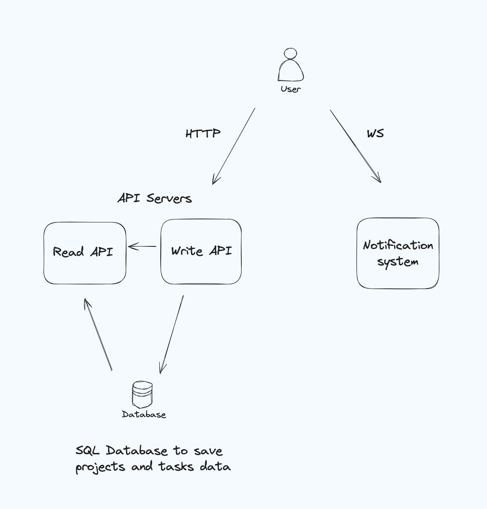

# Moveo Projects and Tasks Management

## Overview

This app allows users to create and update their projects. Each project contains tasks that can have one of three states: "todo", "in progress", or "done".

## Project Structure

The project consists of the following components:

- **Server**
- **Two client SPAs**: `authentication` and `app`

The project's backend uses AWS Cognito for user authentication and Supabase as the database (which runs on AWS with PostgreSQL). The database schema is provided in the project's files.

### AWS Cognito

- **User Storage**: Stores each user and provides one of three roles:
  - **Admin**: Full access to all data.
  - **User**: Limited access to their own data and reader's.
  - **Reader**: Can only access reader's data.

### Server

- **Written in TypeScript with ExpressJS**, developed using Bun & Vite.
- **Exposes REST API** and serves static client files.
- **AWS Cognito Integration**: Handles user registration, login, and token-based authentication with JWT. Each login adds a JWT cookie that is verified in each request via middleware.
- **Role-Based Access**: The server checks the user's role from the JWT token and adjusts database queries accordingly.
- **API Endpoints**: The REST API supports CRUD operations for projects and tasks.

### Auth Page

- **Written in React, StyledComponents, TypeScript**, developed with Bun & Vite.
- **Functionality**: Provides login and registration functionality using AWS Cognito.

### Client Page

- **Written in React, StyledComponents, TypeScript**, developed with Bun & Vite.
- **Features**: Fetches all of the user's projects and tasks. Provides functionality to add, edit, and delete tasks via modal overlays. After each change, the client refetches data to display the most recent updates.

## Installation

### Pre-requisites:

- Install **Bun**: [Bun Installation Guide](https://bun.sh/) (alternative to Node.js)

### Steps:

1. **Clone the repository**:
   ```bash
   git clone https://github.com/ofrilev/moveo_users-task_project_management.git
   ```
2. **Navigate to the Moveo directory and run the server:**
   ```bash
   cd moveo_users-task_project_management/server
   bun i
   bun run dev
   ```
   3. **Open the app in your browser: http://localhost:8080/**
      For running only the client:
      cd client
      bun run dev

bash
Copy code

### Additional Features

Pagination
I began developing a pagination mechanism but couldn't complete it. Here’s a suggestion for implementing pagination in the future:

The API for projects and tasks can support pagination via query parameters:

/app/tasks?page=2&limit=10
limit: Number of items per page
page: Page number
Response Metadata:

total_count: Total items available
total_pages: Total number of pages
current_page: Current page number
next_page and previous_page: Links or indicators for navigation
This approach allows the client to fetch partial data and display a summary of total projects and tasks. Users can initially view the most recent items and load more as needed.

Role-Based Access Control
A basic role-based control has been implemented, but full role-based access control can be added. Here’s my suggestion for the role-based access control:

Admin: Full access to all projects and tasks.
User: Access to projects and tasks designated for the user role.
Read-Only: No write permissions; access only to projects and tasks marked as read-only.
Deployment Suggestions
Task Management API
Considering the system’s read and write-heavy nature, I suggest distributing the API across multiple servers to separate read and write operations. This will enhance performance and scalability, ensuring that write operations are not affected during periods of high user traffic.

Database
For improved performance and reliability, I recommend using data replication. Direct read requests to replica databases and handle write operations with the primary database.

Notification Service
To support real-time updates, integrate a notification service that uses WebSocket connections with clients. This will allow the system to send delta information whenever tasks are updated.

